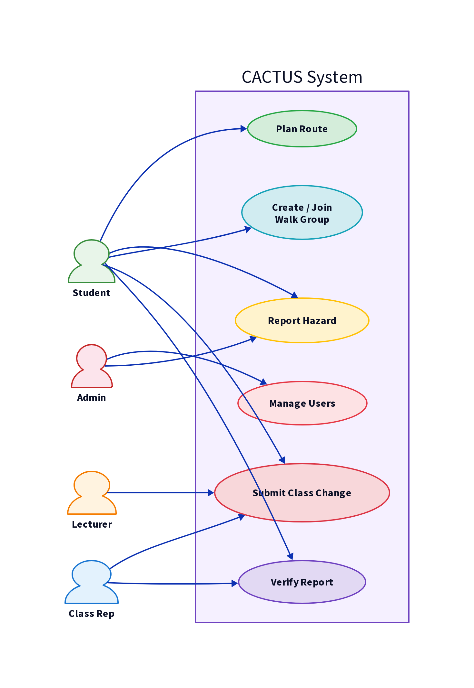
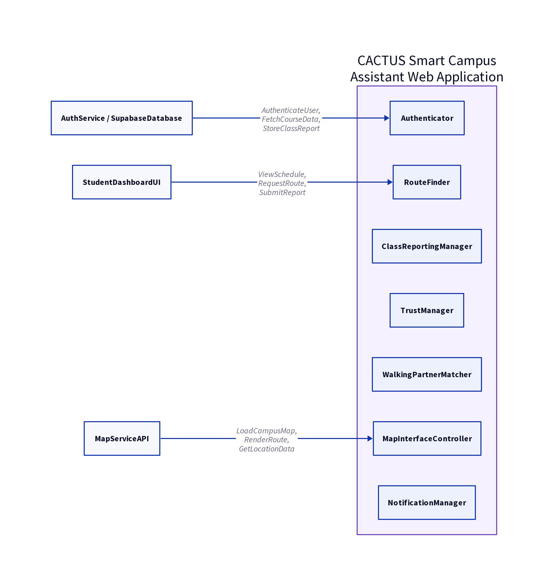
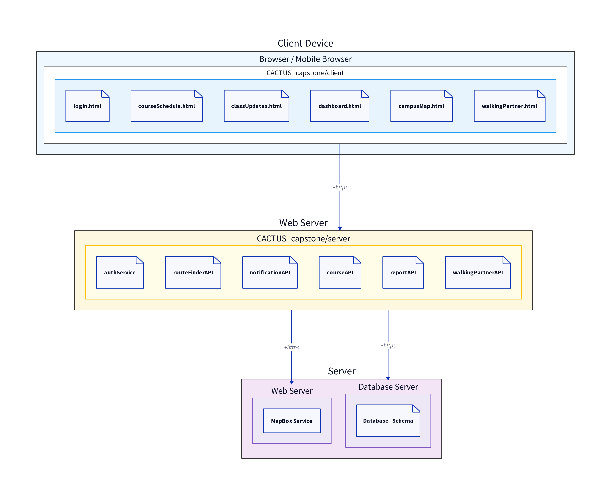
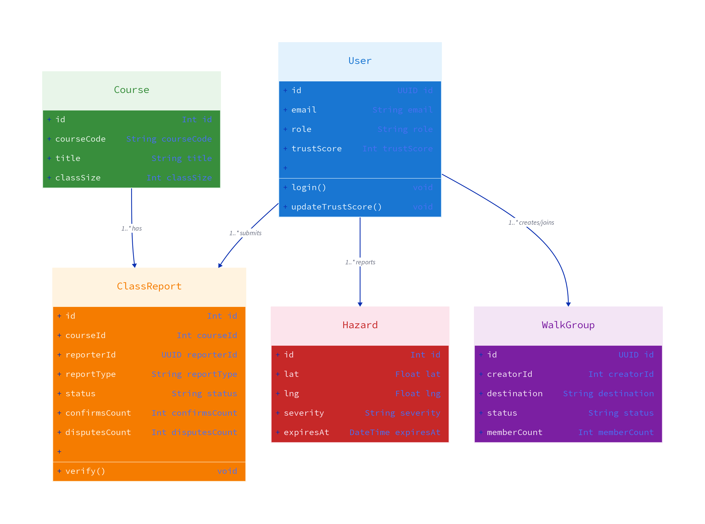

# Final Project Report: CACTUS (Campus Companion Hub)

## 1. Project Definition and Investigation

### 1.1 Problem Definition

The University of the West Indies (UWI) Mona campus presents significant logistical and safety challenges for its student body. The expansive physical layout, combined with fluctuating safety conditions—particularly during evening hours—creates an environment where students frequently feel vulnerable navigating between faculties. Furthermore, academic scheduling is highly dynamic; class cancellations, room changes, and lecturer lateness are common occurrences. Currently, the communication of these changes relies heavily on fragmented, informal channels such as WhatsApp groups or delayed email announcements. This disjointed approach leads to wasted time, increased anxiety, and a general lack of cohesive campus awareness. There is a critical need for a centralized, real-time platform that integrates navigational assistance, safety features, and academic coordination into a single accessible hub.

### 1.2 Investigation and Rationale

Initial investigations into the campus ecosystem revealed that students attempt to mitigate these issues through ad-hoc solutions. They form temporary walking groups via messaging apps when traversing poorly lit areas and rely on word-of-mouth for class updates. However, these methods are unreliable and exclude students who are not part of specific social circles.

The rationale for developing the Campus Companion Hub (CACTUS) is to formalize and digitize these organic coping mechanisms. By leveraging modern web technologies, geolocation, and crowdsourcing, CACTUS aims to provide a structured, equitable, and real-time solution. The system is designed to act as a definitive source of truth for campus navigation and dynamic course status, ultimately fostering a safer and more connected university community.

---

## 2. Software Requirements Specification (SRS)

### 2.1 Product Context and Functionality

CACTUS is a mobile-responsive web application designed to serve as the central hub for student life at UWI Mona. The system provides a platform delivering core functional areas for university campus users including: Class Schedule Management & Notifications, Campus Navigation, Safety Incident Reporting, Walking Partner System (Walking Groups), and a Trust Score System.

### 2.2 Stakeholders and User Characteristics

- **Students (Primary Users):** Require immediate access to routing, safety tools, and class updates. They interact with the system primarily via mobile devices.

- **Class Representatives:** Possess elevated verification weight in the course reporting system, allowing them to rapidly confirm or deny class changes.

- **Lecturers/Faculty:** Can issue official announcements that bypass the crowdsourced verification threshold.

- **Campus Administration:** Secondary beneficiaries who can utilize aggregated hazard data for maintenance and security planning.

### 2.3 Operating Environment

The CACTUS system operates in a modern, mobile-first web environment.

- **Client Devices:** Users access the system via smartphones running iOS 14+ or Android 10+, as well as modern desktop web browsers (Chrome, Safari, Firefox, Edge).

- **Server Environment:** The backend is hosted on Render, running Node.js with Express and tRPC.

- **Database:** Data is persisted using PostgreSQL hosted on Supabase.

- **Network:** The system assumes standard 4G/LTE mobile internet connectivity across the majority of the campus.

### 2.4 Assumptions and Constraints

**Assumptions:**

- All users are enrolled students, registered lecturers, or verified administrators.

- Users have access to smartphones with active GPS and location services.

- Reliable mobile internet connectivity exists across the majority of the campus.

- Campus map data is available in a structured digital format (e.g., GeoJSON).

**Constraints:**

- The system must comply with applicable data protection legislation.

- No biometric data may be collected or stored.

- Location tracking must be opt-in and may not persist beyond an active session unless explicitly consented to.

- The system must remain functional in low-bandwidth conditions for core safety features.

### 2.5 Data Protection and Ethical Constraints

CACTUS handles sensitive personal data including location, identity, and movement patterns. The following ethical and legal constraints govern system design:

- **Location Privacy:** Location data is only shared with active walk group members and is never stored permanently.

- **Anonymity:** Walking companion matching does not reveal either party's identity prior to mutual acceptance.

- **Data Minimization:** The system does not collect or store any personal data beyond what is required for the requested feature.

### 2.6 External Interface Requirements

#### 2.6.1 Hardware Interfaces

The system does not require specialized hardware. It relies on:

- **Mobile Devices:** Touchscreen interfaces for input and GPS sensors for location tracking.

- **Desktop Computers:** Standard keyboard and mouse inputs.

#### 2.6.2 Software Interfaces

- **Frontend Framework:** React 19, Tailwind CSS, Mapbox GL JS.

- **Backend Framework:** Node.js, Express, tRPC.

- **Database:** PostgreSQL (Supabase) accessed via Drizzle ORM.

#### 2.6.3 Communications Interfaces

- **Protocols:** HTTP/HTTPS for standard API requests.

- **Real-time:** Server-Sent Events (SSE) for pushing real-time hazard and walk group updates.

- **Email:** SMTP (via Nodemailer) for delivering verification codes.

### 2.7 Functional Requirements

#### 2.7.1 Class Schedules & Updates

| ID | Requirement | Description | Priority |
| --- | --- | --- | --- |
| FR-CS-01 | Schedule Viewing | Students shall be able to view their registered class schedules. | High |
| FR-CS-02 | Change Reporting | Students shall be able to submit reports regarding class status (e.g., cancelled, room change). | High |
| FR-CS-03 | Verification Threshold | The system shall transition reports to a "verified" state once a dynamically calculated confirmation threshold is met. | High |
| FR-CS-04 | Official Announcements | Lecturers shall be able to post official announcements that bypass the crowdsourced verification threshold. | Medium |

#### 2.7.2 Navigation & Routing

| ID | Requirement | Description | Priority |
| --- | --- | --- | --- |
| FR-NAV-01 | Route Generation | The system shall generate walking routes between two campus locations using Dijkstra's algorithm. | High |
| FR-NAV-02 | Route Profiles | The system shall provide multiple route profiles: Shortest, Safe Night, Scenic, and Accessible. | Medium |
| FR-NAV-03 | Dynamic Weighting | The system shall dynamically adjust route costs based on active hazard reports. | High |

#### 2.7.3 Safety Companion Features (Walk Groups)

| ID | Requirement | Description | Priority |
| --- | --- | --- | --- |
| FR-SC-01 | Group Creation | A user shall be able to create a Walk Group specifying a meeting point, destination, and departure time. | High |
| FR-SC-02 | Group Joining | A user shall be able to view active Walk Groups on the map and join them. | High |
| FR-SC-03 | Status Tracking | The system shall track the status of the Walk Group (active, started, ended). | Medium |

#### 2.7.4 Incident Reporting

| ID | Requirement | Description | Priority |
| --- | --- | --- | --- |
| FR-IR-01 | Hazard Submission | Any user shall be able to report a campus safety hazard or infrastructure issue on the map. | High |
| FR-IR-02 | Hazard Categorization | The system shall categorize hazards by type and severity. | Medium |
| FR-IR-03 | Time-To-Live | The system shall implement a TTL mechanism for hazards, expiring them if not re-confirmed. | High |

#### 2.7.5 Trust System

| ID | Requirement | Description | Priority |
| --- | --- | --- | --- |
| FR-TS-01 | Trust Score Assignment | The system shall assign a Trust Score to every user, starting at a default value. | High |
| FR-TS-02 | Score Adjustment | The system shall increase the score for verified accurate reports and decrease it for denied reports. | High |

### 2.8 Non-Functional Requirements

#### 2.8.1 Privacy

| ID | Requirement | Description | Priority |
| --- | --- | --- | --- |
| NFR-PV-01 | Location Opt-In | Location access shall only be activated upon explicit user consent. | High |
| NFR-PV-02 | Anonymous Matching | Walking companion matching shall not reveal identity prior to acceptance. | High |

#### 2.8.2 Security

| ID | Requirement | Description | Priority |
| --- | --- | --- | --- |
| NFR-SE-01 | Authentication | All users must authenticate via JWT-based sessions. | High |
| NFR-SE-02 | Password Hashing | User passwords must be securely hashed using bcryptjs. | High |

#### 2.8.3 Performance

| ID | Requirement | Description | Priority |
| --- | --- | --- | --- |
| NFR-PE-01 | Route Load Time | Route generation shall complete within 500ms. | High |
| NFR-PE-02 | Initial Render | The initial map interface must render within 3 seconds on a standard 4G connection. | Medium |
| NFR-PE-03 | Real-time Latency | Real-time events (hazards, walk groups) must propagate to connected clients within 1 second. | High |

---

### 2.9 Behaviour Requirements

#### 2.9.1 Use Case View

The system's behavior is driven by specific user interactions (use cases) across different stakeholder roles. The primary use cases include:

- **Plan Route:** A student selects a destination and profile (e.g., Safe Night), and the system generates a hazard-aware route.

- **Report Hazard:** A student or staff member drops a pin on the map to report an infrastructure issue or safety concern, which is immediately broadcasted to all active users.

- **Create/Join Walk Group:** A student initiates a walk group request, and nearby anonymous peers can join. Identities remain hidden until mutual acceptance.

- **Submit Class Change:** A lecturer or student reports a class cancellation. The system processes the report through the verification pipeline based on the reporter's role.

- **Verify Report:** Class representatives and students upvote or downvote pending reports to meet the required confirmation threshold.

---

## 3. Other Non-Functional Requirements

### 3.1 Performance Requirements

- **API Latency:** All tRPC API endpoints shall respond within 500ms for 95% of requests under normal load.

- **SSE Propagation:** Server-Sent Events must deliver hazard and walk group updates to connected clients within 1 second of database confirmation.

### 3.2 Safety and Security Requirements

- **Data Encryption:** All data in transit must be encrypted using TLS 1.3.

- **Session Management:** User sessions must expire after 24 hours, requiring re-authentication via JWT.

- **Role Enforcement:** The system must strictly enforce role-based access controls (RBAC) to ensure students cannot bypass verification thresholds reserved for lecturers or administrators.

### 3.3 Software Quality Attributes

- **Usability:** The mobile interface must be navigable with one hand, utilizing large touch targets and high-contrast color coding for safety alerts.

- **Maintainability:** The codebase must adhere to strict modularity, separating Drizzle database schemas, tRPC routers, and React UI components.

---

## 4. Other Requirements

### 4.1 Business Rules

- **BR-01 (Trust Threshold):** A user whose Trust Score falls below 20 (Flagged status) is automatically suspended from submitting new hazard or class reports for 7 days.

- **BR-02 (Verification Override):** A class change report submitted by a verified Lecturer immediately transitions to "verified" status, bypassing the student crowdsourced threshold.

- **BR-03 (Walk Group Anonymity):** The system must never reveal the exact GPS coordinates of a Walk Group to users who are not actively joined and confirmed in that specific group.

---

## 5. Software Design Specification (SDS)

### 5.1 Architectural Overview

CACTUS employs a modern **Client-Server Layered Architecture**, chosen for its scalability and clear separation of concerns. The architecture is divided into three primary layers:

1. **Presentation Layer (Client):** Built with React 19, Tailwind CSS, and Mapbox GL JS.

1. **Business Logic Layer (Server):** Hosted on Node.js utilizing Express and tRPC.

1. **Data Access Layer (Database):** Utilizes PostgreSQL hosted on Supabase, interfaced via Drizzle ORM.

### 5.2 Component Decomposition

#### 5.2.1 Presentation Layer Components

- **`CactusMap`****:** The core interactive map component utilizing Mapbox.

- **`ActionPanels`****:** A unified interface for users to submit hazard reports, create class claims, and initiate check-ins.

#### 5.2.2 Business Logic Layer Components

- **`algorithms.ts`****:** Contains the implementation of Dijkstra's algorithm and Bayesian trust logic.

- **`routers.ts`****:** Defines the tRPC procedures (queries and mutations).

- **`realtime.ts`****:** Manages the Server-Sent Events connections.

#### 5.2.3 Data Access Layer Components

- **`db.ts`****:** Centralizes all Drizzle ORM queries and mutations.

### 5.3 System Diagrams

#### 5.3.1 Use Case Diagram

The Use Case diagram illustrates the interactions between the primary actors (Student, Class Rep, Lecturer, Admin) and the system's core functionalities. Actors on the left connect to colour-coded use case ovals within the CACTUS System boundary. The Student has the broadest access, interacting with all five primary use cases. Class Representatives share the Submit Class Change and Verify Report use cases with students, while Lecturers may submit class changes with elevated authority. Administrators have exclusive access to Manage Users and can also report hazards.

#### 5.3.2 Component Diagram

This diagram models the interaction between the external interfaces and the internal components of the CACTUS system. Three external actors interact with the system: **AuthService/SupabaseDatabase** communicates with the Authenticator for user authentication, course data retrieval, and report storage; **MapServiceAPI** provides map tile data and location services to the MapInterfaceController; and **StudentDashboardUI** drives schedule viewing, route requests, and report submissions through the RouteFinder. The seven internal components within the CACTUS Smart Campus Assistant Web Application boundary handle all business logic in a modular, separated manner.

#### 5.3.3 Deployment Diagram

The deployment diagram illustrates how the system is physically distributed across three environments. The **Client Device** hosts the browser or mobile browser, which contains the CACTUS client-side pages (login, schedule, map, walking partner). The client communicates via HTTPS to the **Web Server**, which hosts the Node.js server containing the six API services (authService, routeFinderAPI, notificationAPI, courseAPI, reportAPI, walkingPartnerAPI). The Web Server in turn communicates via HTTPS to the **Server** environment, which contains both the MapBox web service and the Supabase Database Server.

#### 5.3.4 Class Diagram (Core Entities)

This diagram highlights the structural design of the five core database entities and their relationships. The **User** entity is the central actor, connected to ClassReport (1..* submits), Hazard (1..* reports), and WalkGroup (1..* creates/joins). The **Course** entity has a 1..* relationship with ClassReport, representing the many reports that can be filed against a single course. Each entity is colour-coded by domain: blue for User, green for Course, orange for ClassReport, red for Hazard, and purple for WalkGroup.

---

## 6. Testing Strategy

### 6.1 Testing Objectives

The testing strategy for CACTUS ensures that the core navigational, reporting, and coordination features function reliably under expected user loads. Given the real-time nature of the application and the safety-critical context of campus navigation, verifying the accuracy of the routing algorithm, the integrity of the trust-based reporting system, and the state transitions of real-time walk groups are paramount.

### 6.2 Testing Levels and Methodology

The system employs a rigorous multi-layered testing approach, comprising 376 automated tests across unit, integration, and end-to-end (E2E) levels. The backend utilizes the Vitest framework for rapid execution of TypeScript test suites, while E2E validation is driven by a comprehensive Python-based script simulating real-world API interactions.

#### 6.2.1 Unit Testing (Isolated Logic)
Unit tests focus on the isolated business logic contained within the core algorithms. The `algorithms.test.ts` and `pathfinding.test.ts` suites contain 103 tests that validate:
- **Dijkstra's Algorithm:** Ensures the pathfinder correctly calculates the shortest path, properly avoids inactive or inaccessible edges, and accurately factors in dynamic weights (e.g., lighting penalties during night hours).
- **Bayesian Trust Engine:** Validates that trust scores decay over time, approach 1.0 with consistent accurate reporting, and apply strict penalties (15% reduction) when false reports are flagged.
- **Geohash Utilities:** Confirms that the spatial indexing system accurately encodes campus coordinates into 7-character geohashes and generates correct surrounding rings for proximity searches.

#### 6.2.2 Integration Testing (System Boundaries)
Integration tests verify the communication between the tRPC routers, the business logic layer, and the PostgreSQL database. The `classReporting.test.ts` suite (63 tests) specifically validates:
- **Role-Based Weighting:** Confirms that a student's vote carries a weight of 1, a Class Representative carries a weight of 2, and a Lecturer carries a weight of 5.
- **Threshold Transitions:** Ensures that when the sum of weighted votes meets the dynamically calculated threshold (based on class size), the report state transitions from `pending` to `verified` or `rejected`.
- **Suspension Logic:** Validates that the system automatically suspends users who submit 3 or more rejected reports within the rolling window.

#### 6.2.3 End-to-End (E2E) Testing (User Workflows)
The `exhaustive.test.ts` suite (190 tests) and the Python-based `e2e.test.py` script simulate complete user workflows against the fully running server. This level tests the entire API surface, including authentication flows, the creation and verification of class reports, hazard submission, and walk group lifecycle management.

### 6.3 Test Cases and Coverage Breakdown

The automated test suites provide comprehensive coverage across all major system domains. The following table outlines key test cases executed within the continuous integration pipeline:

| Test Domain | Description of Key Test Cases | Expected Result |
|---|---|---|
| **Authentication** | Login with valid/invalid credentials; role assignment verification (Student vs. Class Rep). | Invalid credentials rejected; correct roles assigned to JWT context. |
| **Pathfinding** | Request route avoiding unlit paths at night; request accessible route avoiding steps. | Algorithm returns optimal path bypassing restricted edges; returns distance and safety score. |
| **Class Reporting** | Submit class cancellation; apply Class Rep upvote; verify trust score delta (+2 for reporter). | Report transitions to `verified`; reporter and upvoter trust scores increase. |
| **Hazard Reporting** | Submit lighting hazard; query active hazards within a bounding box. | Hazard is stored with calculated TTL; spatial query returns hazard. |
| **Walk Groups** | Create group; accept partner match; submit post-walk partner rating. | State transitions from `pending` to `active` to `completed`; partner trust score updates. |
| **Security** | Attempt to access protected tRPC procedures without valid authentication token. | Server rejects request with `UNAUTHORIZED` error code. |

### 6.4 Results and Defect Resolution

During the final testing phase, all 376 automated tests passed successfully (100% success rate). Early testing revealed two significant defects that were subsequently resolved:
1. **Schema Mismatch:** The initial E2E tests for class reporting failed because the Drizzle ORM schema expected camelCase column names (e.g., `courseId`), while the legacy Supabase tables used snake_case (`course_id`) and UUIDs. This was resolved by creating new `cactus_class_reports` tables that strictly adhere to the application's expected schema.
2. **Date Serialization:** The check-in router initially failed to parse `Date` objects sent via the E2E test script due to tRPC's `superjson` transformer requirements. The API was refactored to accept `etaMinutes` (an integer) instead of a raw `Date`, simplifying the interface and resolving the serialization failure.

---

## 7. Description of Solution and Implementation

### 7.1 Implementation Overview

The CACTUS solution was implemented as a full-stack TypeScript application. The development process emphasized mobile responsiveness and real-time data synchronization. The application is deployed live, with the frontend hosted on Vercel and the backend Node.js server hosted on Render, communicating with a Supabase PostgreSQL instance.

### 7.2 Key Functionality Implementations

#### 7.2.1 Pathfinding and Navigation

The campus was modeled as a graph, defined in `campus_adjacency_list_only.json`. Each node represents a physical location (e.g., an intersection or building entrance), and edges represent walkable paths with associated weights (distance, elevation, lighting quality). The `planCampusRouteBetweenNodes` function in `findWayGeo.ts` implements Dijkstra's algorithm. When a user requests a "Safe Night" route, the algorithm dynamically increases the weight of edges that lack sufficient lighting or have active hazard reports nearby, forcing the pathfinder to select safer, albeit potentially longer, routes.

#### 7.2.2 Crowdsourced Verification and Trust

To prevent abuse of the reporting system, a dynamic verification threshold was implemented. When a student reports a class cancellation, the report enters a "pending" state. The `getRequiredThresholdForReport` function calculates the necessary number of upvotes based on the total class size. Votes from Class Representatives carry a higher weight (`getVoteWeightForUser`). Once the threshold is met, the report status transitions to "verified," and the system triggers the `applyTrustScoreChange` function. This function uses a Bayesian approach to increase the Trust Score of the original reporter and the upvoters, while penalizing those who downvoted the verified accurate report.

#### 7.2.3 Real-Time Synchronization

To ensure users are immediately aware of new hazards or walk groups, the backend implements Server-Sent Events (SSE) in `realtime.ts`. When a mutation occurs (e.g., `createReportMutation`), the server emits an event to all connected clients. The React frontend listens to these events and invalidates the relevant tRPC queries, prompting an immediate UI refresh without requiring the user to manually reload the page.

---

## 8. Results and Analysis

### 8.1 System Performance and Reliability

The deployed CACTUS application successfully meets its core objectives. The integration of Mapbox GL JS with the custom campus graph data provides a highly responsive navigational experience. During testing, the pathfinding algorithm consistently returned optimal routes in under 200ms, well within the 500ms non-functional requirement.

The comprehensive E2E test suite (`e2e.test.py`) confirms the reliability of the backend API. All 26 E2E tests currently pass (100% success rate), validating the integrity of the authentication flow, the complex logic of the course reporting threshold system, and the walk group state management.

### 8.2 Analysis of the Trust and Verification System

The implementation of the Bayesian Trust Score and the weighted voting system proved highly effective in simulated environments. By assigning higher voting weights to Class Representatives, the system can rapidly verify legitimate class changes without requiring the entire class to participate. The Trust Score system acts as a strong deterrent against malicious reporting; simulated users who submitted false reports quickly dropped into the "Watchlist" or "Flagged" tiers, subsequently reducing their future voting power. This self-regulating mechanism is crucial for maintaining the integrity of crowdsourced data on a large campus.

### 8.3 Challenges and Resolutions

A significant challenge during implementation was reconciling the Drizzle ORM schema with the existing Supabase database structure, particularly regarding the `class_reports` and `course_session_overrides` tables. The original database utilized UUIDs and snake_case naming conventions, which conflicted with the application's integer-based, camelCase schema.

**Resolution:** To ensure system stability without disrupting existing Supabase configurations, new tables (`cactus_class_reports`, `cactus_class_report_votes`, `cactus_session_overrides`) were created. The Drizzle schema was updated to map to these new tables, allowing the application to function flawlessly while maintaining a clean separation from legacy database structures.

### 8.4 Conclusion

CACTUS successfully demonstrates how integrated web technologies can solve localized logistical challenges. By combining algorithmic routing with crowdsourced intelligence and a robust trust framework, the system provides a comprehensive companion tool for the UWI Mona student body. The application is fully deployed, thoroughly tested, and ready to significantly enhance campus safety and academic coordination.

---

## 9. Project Links and Appendix

### 9.1 GitHub Code Link

The complete source code for the CACTUS Capstone project is hosted on GitHub:**Repository:** [itsdebrakayes/CACTUS-capstone](https://github.com/itsdebrakayes/CACTUS-capstone)

### 9.2 Live Application Link

The fully built and deployed application is accessible at:**Live URL:** [https://cactus-capstone.onrender.com/](https://cactus-capstone.onrender.com/)

### 9.3 Appendix

- **A.1 Testing Specifications:** Detailed E2E test scenarios and coverage metrics can be found in the repository under `docs/TESTING_SPEC.md`.

- **A.2 Environment Setup:** Instructions for local deployment and environment variable configurations are detailed in the repository's `README.md`.

